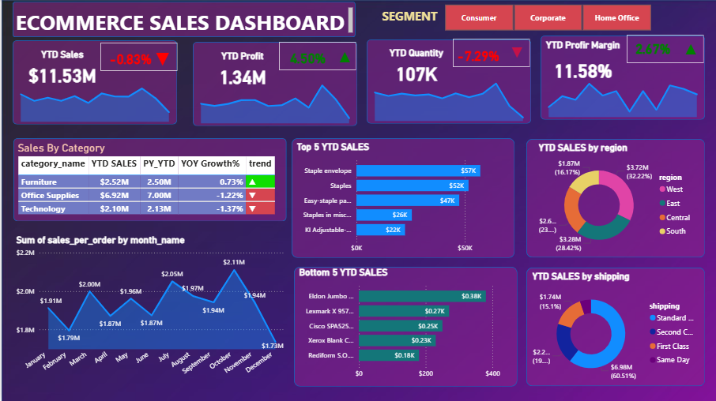

# ️ E-commerce Sales Dashboard – Power BI

##  Project Overview  
This project showcases an **E-commerce Sales Dashboard** built in Power BI for analyzing sales trends, customer behavior, product performance, and regional insights.

---

##  Dashboard Snapshot



---

##  Dataset  
**ecommerce_data.csv** contains the following columns:

- **OrderID** – Unique order identifier  
- **OrderDate** – Date of the sale  
- **CustomerID** – Customer identifier  
- **CustomerName** – Name of the customer  
- **Region** – Region of the sale  
- **ProductID** – Identifier for product sold  
- **ProductName** – Name of the product  
- **Category** – Product category  
- **Quantity** – Units sold  
- **UnitPrice** – Price per unit  
- **TotalPrice** – Calculated as Quantity × UnitPrice

---

##  Data Model  
Data is arranged in Power BI as:

- **Fact Table**: `Fact_Sales` (transactional data)  
- **Dimension Tables**:  
  - `Dim_Customer` – Customer-related details  
  - `Dim_Product` – Product Name and Category  
  - `Dim_Date` – Derived from OrderDate  
  - `Dim_Region` – Region-specific classification

---

##  Dashboard Pages  
1. **Sales Overview** – KPIs, year-over-year trends  
2. **Customer Analysis** – Top buyers, repeat purchase behavior  
3. **Product Analysis** – Best-selling items, category insights  
4. **Regional Analysis** – Sales breakdown by region (map visual)  
5. **Time Analysis** – Trends by month, quarter, year

---

##  Key DAX Measures  
```DAX
Total Sales = SUM(Fact_Sales[TotalPrice])  
Total Quantity = SUM(Fact_Sales[Quantity])  
Average Order Value = DIVIDE([Total Sales], DISTINCTCOUNT(Fact_Sales[OrderID]))  
YoY Sales Growth = 
DIVIDE(
    [Total Sales] - CALCULATE([Total Sales], DATEADD(Dim_Date[Date], -1, YEAR)),
    CALCULATE([Total Sales], DATEADD(Dim_Date[Date], -1, YEAR))
)
